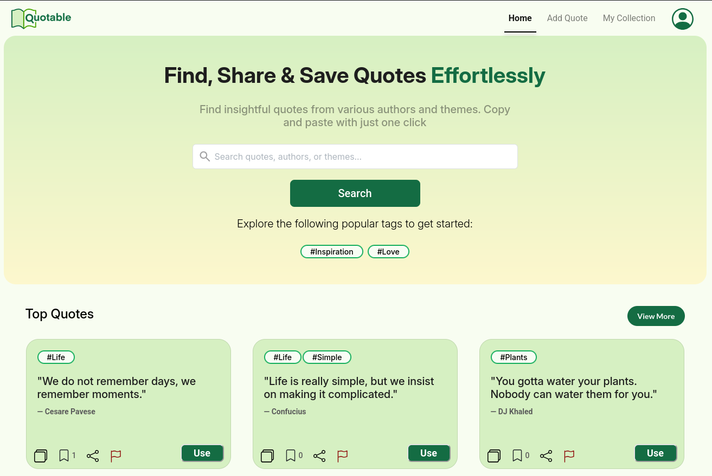

<p align="center">

# Quotable / OZ-CSC-480-HCI-521-Spring-2025



</p>

Quotable is a web application designed for anyone needing an inspirational quote quickly to search for and copy-paste inspirational quotes for their own use. This application caters to professors, students, researchers, coaches, and general quote enthusiasts and needs an intuitive system for searching, organizing, and managing their collections. The platform supports personalized accounts, guest access, and social engagement features such as favoriting quotes.

| Links                                                                                              |
| -------------------------------------------------------------------------------------------------- |
| [SRS Document](https://docs.google.com/document/d/1eaA5o688PClz5G2ZMMQ5dVexTfmFbmaJX3fBd1d2m9Y/)   |
| [Project Board](https://github.com/orgs/Paul-Austin-Oswego-CSC480-HCI521/projects/1)               |
| [QA Test Log](https://docs.google.com/spreadsheets/d/134NhDiqUuISiPfJnnsxo-fcyLlgag4zuN_Ux8XAp5cs) |
| [Figma Design Doc](https://www.figma.com/design/hyl3PKGhSoGDiGxFTX5C3X/Draft-Med--Fi)              |

---

### Development Environment Setup

0. Make sure you have `java jdk17` and `docker` installed.
1. Clone the repo using `git clone`, and `cd` into the project
2. Create a new file in the root directory of the project called `.env`, and fill out the following:

```.env
# Create a google API client: https://console.cloud.google.com/apis/credentials
# Then fill out the following variables to match your credentials
CLIENT_ID=
CLIENT_SECRET=
REDIRECT_URI=http://localhost:9081/users/auth/callback # <-- default

# The URL to the backend proxy service that is running
VITE_PROXY_URL=http://localhost:9083 # <-- default

 # Add the following service URLs used by the backend
 USER_SERVICE_URL=http://localhost:9081
 QUOTE_SERVICE_URL=http://localhost:9082
```

To start the whole stack, run the following command in the root directory:

```
docker compose up
```

---

### Developing the Frontend

Use these steps if you want a quick way to test your changes while building the frontend. **Make sure you've followed the steps above before continuing.**

1. Edit the docker compose file to prevent the compose stack from running the frontend container:

```diff
services:
-  frontend:
-    build: ./frontend/src/main/frontend
-    ports:
-      - 9080:80
+  # frontend:
+  #   build: ./frontend/src/main/frontend
+  #   ports:
+  #     - 9080:80
```

```diff
  nginx:
    image: nginx:latest
    container_name: nginx-proxy
    ports:
      - "9083:80"
    volumes:
      - ./proxy/nginx.conf:/etc/nginx/nginx.conf:ro
    depends_on:
-     - frontend
+   # - frontend
      - user-service
      - quotes-service
```

2. Edit the proxy configuration so it no longer depends on the frontend running

```diff
    location / {
-   proxy_pass http://frontend/;
+   proxy_pass http://localhost:9080/;
    proxy_http_version 1.1;

    proxy_set_header Host $host;
```

3. `cd` into `frontend/src/main/frontend`
4. Make sure the dependencies are up to date by running `npm install`
5. Run the dev server by using `npm run dev`

---

### Developing the Backend

After making your changes to the code, restart the microservices by running the following:

```bash
docker compose down
docker compose up --build
```
